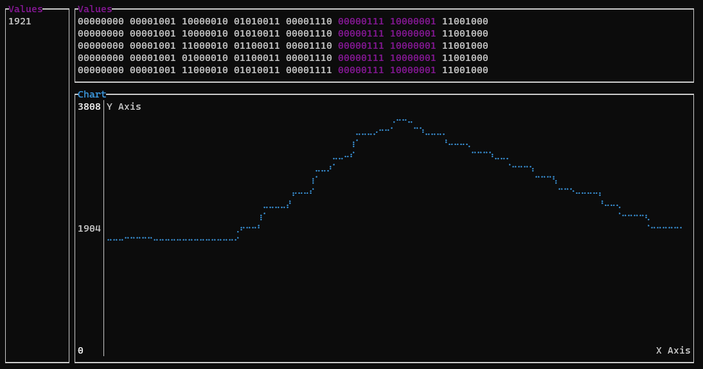
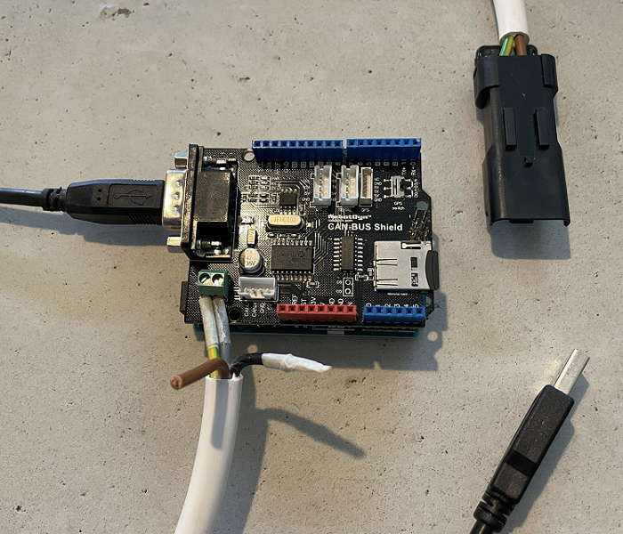

# Can monitor

Monitoring application to see what data is going through the can-bus of your vehicle.  The following features are support:
- Draw a line chart out of byte range for a specific canbus message identifier. 

## Technical

This project consists of two parts, namely the `can_monitor_arduino` and the `can_monitor_client`.

### Can_monitor_arduino 

As the name suggests this application should run on an Arduino and depends on a CAN-BUS Shield. 
- [Arduino UNO R3](https://store.arduino.cc/arduino-uno-rev3)
- [RobotDyn CAN-BUS Shield](https://robotdyn.com/can-bus-shield-for-arduino.html)

CAN-High and CAN-Low pins on the CAN-BUS Shield should connect to the corresponding high and low of your vehicle. Because I use this project to monitor my Ducati Hyperstrada 821 the CAN-High and low are connected to a `Ducati DDA connector` in my case.

### Can_monitor_client

This is the client part and runs in a terminal. It depends on `tui-rs` to build the interface.
- [tui-rs](https://github.com/fdehau/tui-rs)  

